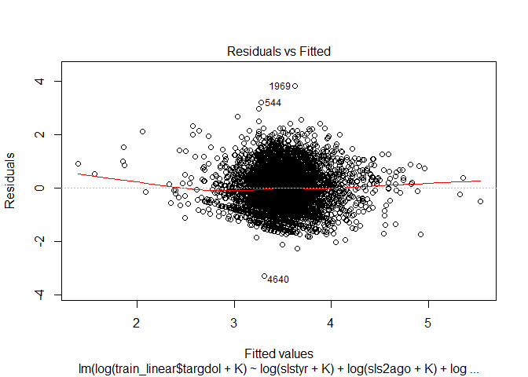

In this file, we try multiple linear regression models and compare them based on the values of $R^2$, number of variables, diagnostic plots, VIFs, etc. Finally, we combine the logistic and linear models together to compute the payoff and MSPE.

## Data Preprocessing

Loading required libraries

```r
library(dplyr)
library(lubridate)
library(ggplot2)
library(tidyr)
library(reshape2)
library(car)
library(bestglm)
library(caret)
library(glmnet)
library(pROC)
library(SDMTools)
```

Reading the data

```r
train <- read.csv("clean_train.csv", stringsAsFactors = FALSE)
test <- read.csv("clean_test.csv", stringsAsFactors = FALSE)
```


Converting both the date variabels to their corresponding integer values, which specifies the number of days since the date 1970-01-01. This is done to make the date continuous variable. Some other variables are converted to factors.


```r
train <- train %>%
    mutate(large_avg = factor(large_avg), pur3yr = factor(pur3yr)) %>%
    mutate(lpurseason = factor(lpurseason), slscmp = factor(slscmp)) %>%
    mutate(id = as.character(id))

test <- test %>%
    mutate(large_avg = factor(large_avg), pur3yr = factor(pur3yr)) %>%
    mutate(lpurseason = factor(lpurseason), slscmp = factor(slscmp)) %>%
    mutate(id = as.character(id))
```

Removing last purchase year from the data because we have already accounted for the last purchase date in the `datelp6` variable. Now we create a test and a training data set for the logistic regression modeling process.


```r
train_linear <- train %>%
    filter(responded==1) %>%
    select(-datead6, -datelp6) %>%
    select(-train, -lpuryear, -responded, -lpurseason_year, -recency_bin) 

test_linear <- test %>%
    select(-datead6, -datelp6) %>%
    select(-train, -lpuryear, -responded, -lpurseason_year, -recency_bin)
```


A small constant to add before taking log of the predictors in the linear models.

```r
K = 0.0001
```


## Multiple Linear Regression Models

In this section we will fir various linear models. The intuition behind these models is described in the project report. We improve upon the linear models in terms of $R^2$ and adjusted $R^2$ and try to reduce the number of variables in the model using backwards stepwise regression and removing the non significant variables.

Fitting a multiple regression model on `targdol` as response but only where `targdol>0`. 

### linear1

Fitting the linear model with targdol as reponse

```r
linear1 <- lm(targdol ~ . , data = select(train_linear, -id, -slshist, -ordhist, -ord4bfr))
summary(linear1)
```

```

Call:
lm(formula = targdol ~ ., data = select(train_linear, -id, -slshist, 
    -ordhist, -ord4bfr))

Residuals:
    Min      1Q  Median      3Q     Max 
-190.45  -24.69  -11.84    9.01 1657.55 

Coefficients:
                   Estimate Std. Error t value Pr(>|t|)    
(Intercept)       4.287e+01  9.178e+00   4.671 3.07e-06 ***
slstyr            1.692e-01  2.420e-02   6.988 3.16e-12 ***
slslyr            1.154e-01  2.319e-02   4.976 6.73e-07 ***
sls2ago           1.705e-01  2.473e-02   6.892 6.21e-12 ***
sls3ago           4.734e-02  1.569e-02   3.018  0.00256 ** 
ordtyr           -4.145e+00  1.838e+00  -2.255  0.02417 *  
ordlyr           -4.822e+00  1.570e+00  -3.070  0.00215 ** 
ord2ago          -5.321e+00  1.634e+00  -3.257  0.00113 ** 
ord3ago          -4.431e+00  1.550e+00  -2.859  0.00426 ** 
falord            1.389e+00  6.331e-01   2.194  0.02825 *  
sprord            6.227e-01  7.183e-01   0.867  0.38600    
lpurseasonspring  6.436e+00  1.974e+00   3.260  0.00112 ** 
recency           2.914e-04  2.844e-03   0.102  0.91838    
lifetime         -8.172e-04  1.051e-03  -0.778  0.43682    
active           -1.105e+01  8.683e+00  -1.272  0.20330    
avg_amount       -5.055e-02  2.958e-02  -1.709  0.08754 .  
large_avg1        1.131e+01  2.083e+00   5.429 5.94e-08 ***
pur3yr1          -1.499e+00  3.681e+00  -0.407  0.68393    
slscmp1          -2.922e+00  2.696e+00  -1.084  0.27855    
sls4bfr           3.036e-02  9.312e-03   3.260  0.00112 ** 
---
Signif. codes:  0 '***' 0.001 '**' 0.01 '*' 0.05 '.' 0.1 ' ' 1

Residual standard error: 51.18 on 4825 degrees of freedom
Multiple R-squared:  0.0951,	Adjusted R-squared:  0.09153 
F-statistic: 26.69 on 19 and 4825 DF,  p-value: < 2.2e-16
```

```r
pred_test <- predict(linear1, newdata = select(test_linear, -id, -slshist, - ordhist, - ord4bfr))

targdol_test <- data.frame(id = test_linear$id, targdol = pred_test)
```

### linear2

We did a backward stepwise regression on all possible pairs of interactions, and then removed the interaction terms that did not make practical business sense. We then again performed backwards stepwise regression. This was the model that we obtained.


```r
linear2 <- lm(train_linear$targdol ~ slstyr + 
                                            sls2ago + 
                                            sls3ago +
                                            ordlyr +
                                            ord2ago + 
                                            ord3ago +
                                            falord +
                                            active +
                                            lifetime +
                                            lpurseason + 
                                            avg_amount + 
                                            pur3yr +
                                            slstyr:ordtyr + 
                                            slstyr:avg_amount + 
                                            slstyr:slscmp + 
                                            slslyr:ordlyr + 
                                            slslyr:avg_amount + 
                                            slslyr:lifetime +
                                            sls2ago:ord2ago + 
                                            sls2ago:recency +
                                            ordtyr:ordlyr + 
                                            ordtyr:avg_amount + 
                                            ordlyr:lifetime +
                                            ord2ago:recency +
                                            avg_amount:large_avg + 
                                            avg_amount:active + 
                                            active:recency + 
                                            active:pur3yr + 
                                            lifetime:recency + 
                                            lifetime:pur3yr + 
                                            avg_amount:pur3yr 
                                            ,data = train_linear)

summary(linear2)
```

```

Call:
lm(formula = train_linear$targdol ~ slstyr + sls2ago + sls3ago + 
    ordlyr + ord2ago + ord3ago + falord + active + lifetime + 
    lpurseason + avg_amount + pur3yr + slstyr:ordtyr + slstyr:avg_amount + 
    slstyr:slscmp + slslyr:ordlyr + slslyr:avg_amount + slslyr:lifetime + 
    sls2ago:ord2ago + sls2ago:recency + ordtyr:ordlyr + ordtyr:avg_amount + 
    ordlyr:lifetime + ord2ago:recency + avg_amount:large_avg + 
    avg_amount:active + active:recency + active:pur3yr + lifetime:recency + 
    lifetime:pur3yr + avg_amount:pur3yr, data = train_linear)

Residuals:
    Min      1Q  Median      3Q     Max 
-174.28  -24.44  -11.69    9.84 1659.60 

Coefficients:
                        Estimate Std. Error t value Pr(>|t|)    
(Intercept)            4.495e+01  1.101e+01   4.084 4.49e-05 ***
slstyr                 3.506e-01  7.469e-02   4.694 2.75e-06 ***
sls2ago                1.076e-01  1.881e-01   0.572 0.567391    
sls3ago               -3.559e-03  1.668e-02  -0.213 0.831006    
ordlyr                -3.133e+00  2.663e+00  -1.176 0.239512    
ord2ago               -2.348e+01  1.084e+01  -2.167 0.030304 *  
ord3ago               -2.081e+00  1.471e+00  -1.415 0.157021    
falord                 1.871e+00  4.940e-01   3.786 0.000155 ***
active                 9.851e+01  6.168e+01   1.597 0.110283    
lifetime              -1.088e-02  6.576e-03  -1.654 0.098243 .  
lpurseasonspring       6.721e+00  1.759e+00   3.822 0.000134 ***
avg_amount             1.757e-01  8.103e-02   2.168 0.030209 *  
pur3yr1               -6.290e+00  1.133e+01  -0.555 0.578628    
slstyr:ordtyr          4.723e-02  2.113e-02   2.235 0.025455 *  
slstyr:avg_amount     -9.637e-05  3.242e-05  -2.972 0.002970 ** 
slstyr:slscmp1        -1.601e-01  6.476e-02  -2.472 0.013454 *  
ordlyr:slslyr          1.509e-02  1.382e-02   1.092 0.275025    
avg_amount:slslyr     -2.976e-04  2.664e-04  -1.117 0.263960    
lifetime:slslyr        1.409e-05  8.143e-06   1.730 0.083655 .  
sls2ago:ord2ago        6.015e-02  1.507e-02   3.991 6.67e-05 ***
sls2ago:recency       -3.211e-05  7.779e-05  -0.413 0.679783    
ordlyr:ordtyr          4.771e-01  1.173e+00   0.407 0.684267    
avg_amount:ordtyr     -2.471e-01  4.688e-02  -5.270 1.42e-07 ***
ordlyr:lifetime       -4.394e-04  6.036e-04  -0.728 0.466674    
ord2ago:recency        7.269e-03  4.485e-03   1.621 0.105097    
avg_amount:large_avg1  6.712e-02  6.091e-02   1.102 0.270564    
active:avg_amount      4.665e-01  1.056e-01   4.416 1.03e-05 ***
active:recency        -2.960e-02  1.225e-02  -2.417 0.015700 *  
active:pur3yr1        -4.296e+01  3.691e+01  -1.164 0.244492    
lifetime:recency       2.082e-06  1.068e-06   1.949 0.051377 .  
lifetime:pur3yr1       4.537e-03  4.410e-03   1.029 0.303558    
avg_amount:pur3yr1    -5.560e-02  5.949e-02  -0.934 0.350106    
---
Signif. codes:  0 '***' 0.001 '**' 0.01 '*' 0.05 '.' 0.1 ' ' 1

Residual standard error: 50.85 on 4813 degrees of freedom
Multiple R-squared:  0.1086,	Adjusted R-squared:  0.1029 
F-statistic: 18.92 on 31 and 4813 DF,  p-value: < 2.2e-16
```

```r
pred_test <- predict(linear2, newdata = test_linear)
targdol_test <- data.frame(id = test_linear$id, targdol = pred_test)
```

### linear3

Because we know the predictors are skewed, we performed linear regression on the log transformed data.


```r
linear3 <- lm(train_linear$targdol ~ log(slstyr + K) + 
                                            log(sls2ago + K) + 
                                            log(sls3ago + K) +
                                            log(ordlyr + K) +
                                            log(ord2ago + K) + 
                                            log(ord3ago + K) +
                                            log(falord + K) +
                                            active +
                                            lifetime +
                                            lpurseason + 
                                            log(avg_amount + K) + 
                                            pur3yr +
                                            log(slstyr + K):log(ordtyr + K) + 
                                            log(slstyr + K):log(avg_amount + K) + 
                                            log(slstyr + K):slscmp + 
                                            log(slslyr + K):log(ordlyr + K) + 
                                            log(slslyr + K):log(avg_amount + K) + 
                                            log(slslyr + K):lifetime +
                                            log(sls2ago + K):log(ord2ago + K) + 
                                            log(sls2ago + K):recency +
                                            log(ordtyr + K):log(ordlyr + K) + 
                                            log(ordtyr + K):log(avg_amount + K) + 
                                            log(ordlyr + K):lifetime +
                                            log(ord2ago + K):recency +
                                            log(avg_amount + K):large_avg + 
                                            log(avg_amount + K):active + 
                                            active:recency + 
                                            active:pur3yr + 
                                            lifetime:recency + 
                                            lifetime:pur3yr + 
                                            log(avg_amount + K):pur3yr 
                                            ,data = train_linear)

summary(linear3)
```

```

Call:
lm(formula = train_linear$targdol ~ log(slstyr + K) + log(sls2ago + 
    K) + log(sls3ago + K) + log(ordlyr + K) + log(ord2ago + K) + 
    log(ord3ago + K) + log(falord + K) + active + lifetime + 
    lpurseason + log(avg_amount + K) + pur3yr + log(slstyr + 
    K):log(ordtyr + K) + log(slstyr + K):log(avg_amount + K) + 
    log(slstyr + K):slscmp + log(slslyr + K):log(ordlyr + K) + 
    log(slslyr + K):log(avg_amount + K) + log(slslyr + K):lifetime + 
    log(sls2ago + K):log(ord2ago + K) + log(sls2ago + K):recency + 
    log(ordtyr + K):log(ordlyr + K) + log(ordtyr + K):log(avg_amount + 
    K) + log(ordlyr + K):lifetime + log(ord2ago + K):recency + 
    log(avg_amount + K):large_avg + log(avg_amount + K):active + 
    active:recency + active:pur3yr + lifetime:recency + lifetime:pur3yr + 
    log(avg_amount + K):pur3yr, data = train_linear)

Residuals:
    Min      1Q  Median      3Q     Max 
-102.29  -24.91  -11.71    9.71 1658.88 

Coefficients:
                                      Estimate Std. Error t value Pr(>|t|)
(Intercept)                         -4.334e+01  1.891e+01  -2.292 0.021945
log(slstyr + K)                      8.462e-01  1.107e+00   0.764 0.444831
log(sls2ago + K)                     8.746e+00  5.700e+00   1.534 0.125040
log(sls3ago + K)                     7.534e-01  1.075e+00   0.701 0.483503
log(ordlyr + K)                      2.781e+00  2.522e+00   1.103 0.270268
log(ord2ago + K)                    -7.208e+00  7.605e+00  -0.948 0.343269
log(ord3ago + K)                    -1.068e+00  1.469e+00  -0.727 0.466982
log(falord + K)                      1.982e-01  2.718e-01   0.729 0.466030
active                               9.100e+01  6.656e+01   1.367 0.171631
lifetime                            -1.703e-02  8.202e-03  -2.077 0.037890
lpurseasonspring                     5.601e+00  1.968e+00   2.845 0.004456
log(avg_amount + K)                  1.588e+01  3.577e+00   4.438 9.26e-06
pur3yr1                              2.003e+01  1.625e+01   1.233 0.217711
log(slstyr + K):log(ordtyr + K)      3.768e-01  1.353e-01   2.784 0.005389
log(slstyr + K):log(avg_amount + K)  6.211e-01  2.208e-01   2.814 0.004919
log(slstyr + K):slscmp1              1.509e+00  8.695e-01   1.736 0.082635
log(ordlyr + K):log(slslyr + K)      5.846e-01  2.542e-01   2.300 0.021497
log(avg_amount + K):log(slslyr + K)  6.334e-01  1.680e-01   3.771 0.000164
lifetime:log(slslyr + K)             6.300e-05  2.885e-04   0.218 0.827184
log(sls2ago + K):log(ord2ago + K)    7.919e-01  2.585e-01   3.063 0.002203
log(sls2ago + K):recency            -1.480e-03  2.275e-03  -0.650 0.515412
log(ordlyr + K):log(ordtyr + K)      1.411e-01  4.529e-02   3.116 0.001842
log(avg_amount + K):log(ordtyr + K) -1.716e-01  3.036e-01  -0.565 0.572023
log(ordlyr + K):lifetime            -4.441e-05  4.014e-04  -0.111 0.911900
log(ord2ago + K):recency             2.989e-03  2.923e-03   1.023 0.306570
log(avg_amount + K):large_avg1       2.014e+00  5.834e-01   3.451 0.000562
active:log(avg_amount + K)           1.905e+01  4.207e+00   4.528 6.10e-06
active:recency                      -4.442e-02  1.356e-02  -3.276 0.001060
active:pur3yr1                      -5.648e+01  3.801e+01  -1.486 0.137338
lifetime:recency                     4.556e-06  1.762e-06   2.586 0.009746
lifetime:pur3yr1                     6.594e-03  4.789e-03   1.377 0.168569
log(avg_amount + K):pur3yr1         -9.877e+00  2.469e+00  -4.000 6.44e-05
                                       
(Intercept)                         *  
log(slstyr + K)                        
log(sls2ago + K)                       
log(sls3ago + K)                       
log(ordlyr + K)                        
log(ord2ago + K)                       
log(ord3ago + K)                       
log(falord + K)                        
active                                 
lifetime                            *  
lpurseasonspring                    ** 
log(avg_amount + K)                 ***
pur3yr1                                
log(slstyr + K):log(ordtyr + K)     ** 
log(slstyr + K):log(avg_amount + K) ** 
log(slstyr + K):slscmp1             .  
log(ordlyr + K):log(slslyr + K)     *  
log(avg_amount + K):log(slslyr + K) ***
lifetime:log(slslyr + K)               
log(sls2ago + K):log(ord2ago + K)   ** 
log(sls2ago + K):recency               
log(ordlyr + K):log(ordtyr + K)     ** 
log(avg_amount + K):log(ordtyr + K)    
log(ordlyr + K):lifetime               
log(ord2ago + K):recency               
log(avg_amount + K):large_avg1      ***
active:log(avg_amount + K)          ***
active:recency                      ** 
active:pur3yr1                         
lifetime:recency                    ** 
lifetime:pur3yr1                       
log(avg_amount + K):pur3yr1         ***
---
Signif. codes:  0 '***' 0.001 '**' 0.01 '*' 0.05 '.' 0.1 ' ' 1

Residual standard error: 51.37 on 4813 degrees of freedom
Multiple R-squared:  0.0904,	Adjusted R-squared:  0.08454 
F-statistic: 15.43 on 31 and 4813 DF,  p-value: < 2.2e-16
```

```r
pred_test <- predict(linear3, newdata = test_linear)
targdol_test <- data.frame(id = test_linear$id, targdol = pred_test)
```

Look at the diagnostic plots of this model


```r
plot(linear3, which = c(1,2))
```


We notice that the residuals are linearly increasing with the fitted values and also the qqplot deviates significantly from the $y=x$ line. Therefore we log transform the response in the next linear model.

### linear4

Fitting a linear model with the response log transformed.


```r
linear4 <- lm(log(train_linear$targdol + K) ~ log(slstyr + K) + 
                                            log(sls2ago + K) + 
                                            log(sls3ago + K) +
                                            log(ordlyr + K) +
                                            log(ord2ago + K) + 
                                            log(ord3ago + K) +
                                            log(falord + K) +
                                            active +
                                            lifetime +
                                            lpurseason + 
                                            log(avg_amount + K) + 
                                            pur3yr +
                                            log(slstyr + K):log(ordtyr + K) + 
                                            log(slstyr + K):log(avg_amount + K) + 
                                            log(slstyr + K):slscmp + 
                                            log(slslyr + K):log(ordlyr + K) + 
                                            log(slslyr + K):log(avg_amount + K) + 
                                            log(slslyr + K):lifetime +
                                            log(sls2ago + K):log(ord2ago + K) + 
                                            log(sls2ago + K):recency +
                                            log(ordtyr + K):log(ordlyr + K) + 
                                            log(ordtyr + K):log(avg_amount + K) + 
                                            log(ordlyr + K):lifetime +
                                            log(ord2ago + K):recency +
                                            log(avg_amount + K):large_avg + 
                                            log(avg_amount + K):active + 
                                            active:recency + 
                                            active:pur3yr + 
                                            lifetime:recency + 
                                            lifetime:pur3yr + 
                                            log(avg_amount + K):pur3yr 
                                            ,data = train_linear)

summary(linear4)
```

```

Call:
lm(formula = log(train_linear$targdol + K) ~ log(slstyr + K) + 
    log(sls2ago + K) + log(sls3ago + K) + log(ordlyr + K) + log(ord2ago + 
    K) + log(ord3ago + K) + log(falord + K) + active + lifetime + 
    lpurseason + log(avg_amount + K) + pur3yr + log(slstyr + 
    K):log(ordtyr + K) + log(slstyr + K):log(avg_amount + K) + 
    log(slstyr + K):slscmp + log(slslyr + K):log(ordlyr + K) + 
    log(slslyr + K):log(avg_amount + K) + log(slslyr + K):lifetime + 
    log(sls2ago + K):log(ord2ago + K) + log(sls2ago + K):recency + 
    log(ordtyr + K):log(ordlyr + K) + log(ordtyr + K):log(avg_amount + 
    K) + log(ordlyr + K):lifetime + log(ord2ago + K):recency + 
    log(avg_amount + K):large_avg + log(avg_amount + K):active + 
    active:recency + active:pur3yr + lifetime:recency + lifetime:pur3yr + 
    log(avg_amount + K):pur3yr, data = train_linear)

Residuals:
    Min      1Q  Median      3Q     Max 
-3.3066 -0.5342 -0.0313  0.4872  3.8283 

Coefficients:
                                      Estimate Std. Error t value Pr(>|t|)
(Intercept)                          1.593e+00  2.780e-01   5.728 1.08e-08
log(slstyr + K)                      1.455e-03  1.628e-02   0.089 0.928789
log(sls2ago + K)                     2.189e-01  8.381e-02   2.612 0.009025
log(sls3ago + K)                     1.941e-02  1.581e-02   1.228 0.219600
log(ordlyr + K)                      3.526e-02  3.709e-02   0.951 0.341837
log(ord2ago + K)                    -2.687e-01  1.118e-01  -2.403 0.016281
log(ord3ago + K)                    -2.459e-02  2.159e-02  -1.139 0.254891
log(falord + K)                      6.952e-03  3.997e-03   1.739 0.082024
active                               9.579e-01  9.786e-01   0.979 0.327720
lifetime                            -2.920e-04  1.206e-04  -2.422 0.015488
lpurseasonspring                     8.767e-02  2.894e-02   3.029 0.002463
log(avg_amount + K)                  3.682e-01  5.259e-02   7.001 2.90e-12
pur3yr1                              4.348e-01  2.389e-01   1.820 0.068828
log(slstyr + K):log(ordtyr + K)      6.701e-03  1.990e-03   3.368 0.000764
log(slstyr + K):log(avg_amount + K)  1.570e-02  3.246e-03   4.836 1.37e-06
log(slstyr + K):slscmp1              3.673e-02  1.278e-02   2.873 0.004079
log(ordlyr + K):log(slslyr + K)      9.239e-03  3.737e-03   2.472 0.013457
log(avg_amount + K):log(slslyr + K)  1.281e-02  2.469e-03   5.186 2.23e-07
lifetime:log(slslyr + K)             3.371e-06  4.242e-06   0.795 0.426905
log(sls2ago + K):log(ord2ago + K)    8.280e-03  3.801e-03   2.178 0.029428
log(sls2ago + K):recency            -5.109e-05  3.344e-05  -1.528 0.126636
log(ordlyr + K):log(ordtyr + K)      2.461e-03  6.658e-04   3.696 0.000221
log(avg_amount + K):log(ordtyr + K) -4.711e-03  4.464e-03  -1.055 0.291395
log(ordlyr + K):lifetime            -4.344e-06  5.901e-06  -0.736 0.461720
log(ord2ago + K):recency             8.618e-05  4.298e-05   2.005 0.044991
log(avg_amount + K):large_avg1       1.624e-02  8.577e-03   1.894 0.058339
active:log(avg_amount + K)           3.801e-01  6.185e-02   6.145 8.62e-10
active:recency                      -7.142e-04  1.993e-04  -3.583 0.000343
active:pur3yr1                      -9.393e-01  5.588e-01  -1.681 0.092841
lifetime:recency                     8.308e-08  2.591e-08   3.207 0.001351
lifetime:pur3yr1                     1.180e-04  7.041e-05   1.676 0.093805
log(avg_amount + K):pur3yr1         -2.109e-01  3.631e-02  -5.809 6.67e-09
                                       
(Intercept)                         ***
log(slstyr + K)                        
log(sls2ago + K)                    ** 
log(sls3ago + K)                       
log(ordlyr + K)                        
log(ord2ago + K)                    *  
log(ord3ago + K)                       
log(falord + K)                     .  
active                                 
lifetime                            *  
lpurseasonspring                    ** 
log(avg_amount + K)                 ***
pur3yr1                             .  
log(slstyr + K):log(ordtyr + K)     ***
log(slstyr + K):log(avg_amount + K) ***
log(slstyr + K):slscmp1             ** 
log(ordlyr + K):log(slslyr + K)     *  
log(avg_amount + K):log(slslyr + K) ***
lifetime:log(slslyr + K)               
log(sls2ago + K):log(ord2ago + K)   *  
log(sls2ago + K):recency               
log(ordlyr + K):log(ordtyr + K)     ***
log(avg_amount + K):log(ordtyr + K)    
log(ordlyr + K):lifetime               
log(ord2ago + K):recency            *  
log(avg_amount + K):large_avg1      .  
active:log(avg_amount + K)          ***
active:recency                      ***
active:pur3yr1                      .  
lifetime:recency                    ** 
lifetime:pur3yr1                    .  
log(avg_amount + K):pur3yr1         ***
---
Signif. codes:  0 '***' 0.001 '**' 0.01 '*' 0.05 '.' 0.1 ' ' 1

Residual standard error: 0.7553 on 4813 degrees of freedom
Multiple R-squared:  0.1395,	Adjusted R-squared:  0.134 
F-statistic: 25.18 on 31 and 4813 DF,  p-value: < 2.2e-16
```

```r
pred_test <- predict(linear4, newdata = test_linear)
pred_test <- exp(pred_test)-K
targdol_test <- data.frame(id = test_linear$id, targdol = pred_test)
```

We have also improved on the $R^2$ significantly on this model.

Checking the diagnostic plots of this model


```r
plot(linear4, which = c(1,2))
```



We notice that residuals vs fitted values plot and the qqplot are much closer to the ideal case now.

### linear5

We further remove the non-significant predictors from this model and perform backwards stepwise regression to reduce the number of variables. This is the model that we get,


```r
linear5 <- lm(log(train_linear$targdol + K) ~ log(slstyr + K) + 
                                            log(sls2ago + K) + 
                                            log(ordlyr + K) +
                                            log(ord2ago + K) + 
                                            log(falord + K) +
                                            active +
                                            lifetime +
                                            lpurseason + 
                                            log(avg_amount + K) + 
                                            pur3yr + 
                                            log(slstyr + K):log(ordtyr + K) + 
                                            log(slstyr + K):log(avg_amount + K) + 
                                            log(slstyr + K):slscmp + 
                                            log(slslyr + K):log(ordlyr + K) + 
                                            log(slslyr + K):log(avg_amount + K) +
                                            log(sls2ago + K):log(ord2ago + K) +
                                            log(ordtyr + K):log(ordlyr + K) + 
                                            log(avg_amount + K):large_avg + 
                                            log(avg_amount + K):active + 
                                            active:recency + 
                                            lifetime:recency + 
                                            log(avg_amount + K):pur3yr 
                                            ,data = train_linear)

summary(linear5)
```

```

Call:
lm(formula = log(train_linear$targdol + K) ~ log(slstyr + K) + 
    log(sls2ago + K) + log(ordlyr + K) + log(ord2ago + K) + log(falord + 
    K) + active + lifetime + lpurseason + log(avg_amount + K) + 
    pur3yr + log(slstyr + K):log(ordtyr + K) + log(slstyr + K):log(avg_amount + 
    K) + log(slstyr + K):slscmp + log(slslyr + K):log(ordlyr + 
    K) + log(slslyr + K):log(avg_amount + K) + log(sls2ago + 
    K):log(ord2ago + K) + log(ordtyr + K):log(ordlyr + K) + log(avg_amount + 
    K):large_avg + log(avg_amount + K):active + active:recency + 
    lifetime:recency + log(avg_amount + K):pur3yr, data = train_linear)

Residuals:
    Min      1Q  Median      3Q     Max 
-3.3595 -0.5400 -0.0290  0.4845  3.8008 

Coefficients:
                                      Estimate Std. Error t value Pr(>|t|)
(Intercept)                          1.197e+00  1.804e-01   6.638 3.52e-11
log(slstyr + K)                      1.831e-03  1.626e-02   0.113 0.910343
log(sls2ago + K)                     9.436e-02  1.723e-02   5.475 4.60e-08
log(ordlyr + K)                      2.195e-02  3.472e-02   0.632 0.527384
log(ord2ago + K)                    -6.814e-02  4.016e-02  -1.697 0.089847
log(falord + K)                      6.915e-03  3.985e-03   1.735 0.082751
active                              -1.232e+00  3.306e-01  -3.725 0.000197
lifetime                             1.466e-05  2.829e-05   0.518 0.604444
lpurseasonspring                     9.767e-02  2.800e-02   3.488 0.000490
log(avg_amount + K)                  4.175e-01  4.437e-02   9.411  < 2e-16
pur3yr1                              8.751e-01  1.275e-01   6.865 7.49e-12
log(slstyr + K):log(ordtyr + K)      7.505e-03  1.865e-03   4.024 5.82e-05
log(slstyr + K):log(avg_amount + K)  1.404e-02  2.430e-03   5.777 8.07e-09
log(slstyr + K):slscmp1              3.548e-02  1.260e-02   2.817 0.004867
log(ordlyr + K):log(slslyr + K)      8.788e-03  3.713e-03   2.367 0.017965
log(avg_amount + K):log(slslyr + K)  1.460e-02  1.931e-03   7.562 4.73e-14
log(sls2ago + K):log(ord2ago + K)    7.159e-03  3.787e-03   1.891 0.058747
log(ordlyr + K):log(ordtyr + K)      2.376e-03  6.615e-04   3.592 0.000332
log(avg_amount + K):large_avg1       1.624e-02  8.454e-03   1.921 0.054825
active:log(avg_amount + K)           4.104e-01  5.950e-02   6.898 5.96e-12
active:recency                      -1.797e-04  8.777e-05  -2.048 0.040654
lifetime:recency                     1.245e-09  7.482e-09   0.166 0.867827
log(avg_amount + K):pur3yr1         -2.403e-01  3.351e-02  -7.172 8.53e-13
                                       
(Intercept)                         ***
log(slstyr + K)                        
log(sls2ago + K)                    ***
log(ordlyr + K)                        
log(ord2ago + K)                    .  
log(falord + K)                     .  
active                              ***
lifetime                               
lpurseasonspring                    ***
log(avg_amount + K)                 ***
pur3yr1                             ***
log(slstyr + K):log(ordtyr + K)     ***
log(slstyr + K):log(avg_amount + K) ***
log(slstyr + K):slscmp1             ** 
log(ordlyr + K):log(slslyr + K)     *  
log(avg_amount + K):log(slslyr + K) ***
log(sls2ago + K):log(ord2ago + K)   .  
log(ordlyr + K):log(ordtyr + K)     ***
log(avg_amount + K):large_avg1      .  
active:log(avg_amount + K)          ***
active:recency                      *  
lifetime:recency                       
log(avg_amount + K):pur3yr1         ***
---
Signif. codes:  0 '***' 0.001 '**' 0.01 '*' 0.05 '.' 0.1 ' ' 1

Residual standard error: 0.7562 on 4822 degrees of freedom
Multiple R-squared:  0.1359,	Adjusted R-squared:  0.132 
F-statistic: 34.48 on 22 and 4822 DF,  p-value: < 2.2e-16
```

```r
pred_test <- predict(linear5, newdata = test_linear)
pred_test <- exp(pred_test)-K
targdol_test <- data.frame(id = test_linear$id, targdol = pred_test)
```


Looking at the variance inflation factors of this model

```r
vif(linear5)
```

```
                    log(slstyr + K)                    log(sls2ago + K) 
                          92.724608                           98.555145 
                    log(ordlyr + K)                    log(ord2ago + K) 
                         222.123397                          285.491145 
                    log(falord + K)                              active 
                           1.604966                           58.138433 
                           lifetime                          lpurseason 
                          25.831054                            1.659970 
                log(avg_amount + K)                              pur3yr 
                          13.613685                           22.701028 
    log(slstyr + K):log(ordtyr + K) log(slstyr + K):log(avg_amount + K) 
                          52.153746                           26.399066 
             log(slstyr + K):slscmp     log(ordlyr + K):log(slslyr + K) 
                           4.683962                          203.272981 
log(avg_amount + K):log(slslyr + K)   log(sls2ago + K):log(ord2ago + K) 
                          16.478725                          201.921650 
    log(ordlyr + K):log(ordtyr + K)       log(avg_amount + K):large_avg 
                           5.725766                            2.283233 
         active:log(avg_amount + K)                      active:recency 
                          24.303340                           25.322823 
                   lifetime:recency          log(avg_amount + K):pur3yr 
                          18.395613                           23.640252 
```

We find that many variables have large VIFs. This is because we have introduced many interaction terms which will be correlated with each of their constituent terms. This type of colinearity is called structural multicolinearity and can be removed by centering the predictors. This is exactly what we do in the next linear model.

### linear6


```r
linear6 <- lm(log(train_linear$targdol + K) ~ scale(log(slstyr + K)) + 
                                            scale(log(sls2ago + K)) + 
                                            scale(log(ordlyr + K)) +
                                            scale(log(ord2ago + K)) + 
                                            scale(log(falord + K)) +
                                            active +
                                            lifetime +
                                            lpurseason + 
                                            scale(log(avg_amount + K)) + 
                                            pur3yr + 
                                            scale(log(slstyr + K)):scale(log(ordtyr + K)) + 
                                            scale(log(slstyr + K)):scale(log(avg_amount + K)) + 
                                            scale(log(slstyr + K)):slscmp + 
                                            scale(log(slslyr + K)):scale(log(ordlyr + K)) + 
                                            scale(log(slslyr + K)):scale(log(avg_amount + K)) + 
                                            scale(log(sls2ago + K)):scale(log(ord2ago + K)) +
                                            scale(log(ordtyr + K)):scale(log(ordlyr + K)) + 
                                            scale(log(avg_amount + K)):large_avg + 
                                            scale(log(avg_amount + K)):active + 
                                            active:recency + 
                                            lifetime:recency + 
                                            scale(log(avg_amount + K)):pur3yr 
                                            ,data = train_linear)

summary(linear6)
```

```

Call:
lm(formula = log(train_linear$targdol + K) ~ scale(log(slstyr + 
    K)) + scale(log(sls2ago + K)) + scale(log(ordlyr + K)) + 
    scale(log(ord2ago + K)) + scale(log(falord + K)) + active + 
    lifetime + lpurseason + scale(log(avg_amount + K)) + pur3yr + 
    scale(log(slstyr + K)):scale(log(ordtyr + K)) + scale(log(slstyr + 
    K)):scale(log(avg_amount + K)) + scale(log(slstyr + K)):slscmp + 
    scale(log(slslyr + K)):scale(log(ordlyr + K)) + scale(log(slslyr + 
    K)):scale(log(avg_amount + K)) + scale(log(sls2ago + K)):scale(log(ord2ago + 
    K)) + scale(log(ordtyr + K)):scale(log(ordlyr + K)) + scale(log(avg_amount + 
    K)):large_avg + scale(log(avg_amount + K)):active + active:recency + 
    lifetime:recency + scale(log(avg_amount + K)):pur3yr, data = train_linear)

Residuals:
    Min      1Q  Median      3Q     Max 
-3.3560 -0.5347 -0.0258  0.4872  3.7887 

Coefficients:
                                                    Estimate Std. Error
(Intercept)                                        2.446e+00  1.610e-01
scale(log(slstyr + K))                            -8.334e-02  2.398e-02
scale(log(sls2ago + K))                            3.448e-01  1.671e-01
scale(log(ordlyr + K))                            -8.856e-02  2.366e-02
scale(log(ord2ago + K))                           -4.563e-01  1.301e-01
scale(log(falord + K))                             2.146e-02  1.374e-02
active                                             1.718e-01  2.836e-01
lifetime                                           1.248e-05  2.830e-05
lpurseasonspring                                   8.762e-02  2.823e-02
scale(log(avg_amount + K))                         2.758e-01  3.690e-02
pur3yr1                                            7.463e-02  5.588e-02
scale(log(slstyr + K)):scale(log(ordtyr + K))      3.723e-01  7.452e-02
scale(log(slstyr + K)):scale(log(avg_amount + K))  8.469e-02  1.424e-02
scale(log(slstyr + K)):slscmp1                     1.045e-01  4.762e-02
scale(log(ordlyr + K)):scale(log(slslyr + K))      3.202e-01  8.264e-02
scale(log(avg_amount + K)):scale(log(slslyr + K))  7.281e-02  1.548e-02
scale(log(sls2ago + K)):scale(log(ord2ago + K))    1.955e-01  1.078e-01
scale(log(ordlyr + K)):scale(log(ordtyr + K))      4.979e-02  1.465e-02
scale(log(avg_amount + K)):large_avg1              8.011e-02  3.506e-02
active:scale(log(avg_amount + K))                  3.748e-01  5.354e-02
active:recency                                    -1.854e-04  8.779e-05
lifetime:recency                                   1.836e-09  7.485e-09
scale(log(avg_amount + K)):pur3yr1                -2.073e-01  3.055e-02
                                                  t value Pr(>|t|)    
(Intercept)                                        15.193  < 2e-16 ***
scale(log(slstyr + K))                             -3.476 0.000513 ***
scale(log(sls2ago + K))                             2.063 0.039131 *  
scale(log(ordlyr + K))                             -3.743 0.000184 ***
scale(log(ord2ago + K))                            -3.508 0.000456 ***
scale(log(falord + K))                              1.562 0.118307    
active                                              0.606 0.544703    
lifetime                                            0.441 0.659203    
lpurseasonspring                                    3.104 0.001918 ** 
scale(log(avg_amount + K))                          7.474 9.15e-14 ***
pur3yr1                                             1.336 0.181741    
scale(log(slstyr + K)):scale(log(ordtyr + K))       4.997 6.04e-07 ***
scale(log(slstyr + K)):scale(log(avg_amount + K))   5.948 2.90e-09 ***
scale(log(slstyr + K)):slscmp1                      2.195 0.028206 *  
scale(log(ordlyr + K)):scale(log(slslyr + K))       3.874 0.000108 ***
scale(log(avg_amount + K)):scale(log(slslyr + K))   4.703 2.63e-06 ***
scale(log(sls2ago + K)):scale(log(ord2ago + K))     1.814 0.069683 .  
scale(log(ordlyr + K)):scale(log(ordtyr + K))       3.399 0.000682 ***
scale(log(avg_amount + K)):large_avg1               2.285 0.022371 *  
active:scale(log(avg_amount + K))                   7.000 2.90e-12 ***
active:recency                                     -2.112 0.034749 *  
lifetime:recency                                    0.245 0.806222    
scale(log(avg_amount + K)):pur3yr1                 -6.785 1.30e-11 ***
---
Signif. codes:  0 '***' 0.001 '**' 0.01 '*' 0.05 '.' 0.1 ' ' 1

Residual standard error: 0.7563 on 4822 degrees of freedom
Multiple R-squared:  0.1356,	Adjusted R-squared:  0.1317 
F-statistic: 34.39 on 22 and 4822 DF,  p-value: < 2.2e-16
```

```r
pred_test <- predict(linear6, newdata = test_linear)
pred_test <- exp(pred_test)-K
targdol_test <- data.frame(id = test_linear$id, targdol = pred_test)
```

### Influential observations and outliers

Cook's distance plot for this model to find influential observations.

```r
plot(linear6, which = 4)
```


Since we did not want to weaken our model by removing all influential observations, we only removed three customers with the highest Cook's distance: 433, 2602, and 4672.


We also find the outliers based on standard residuals using the `rstandard()` function. We consider an observation an outlier if its standardized residual is more than three standard deviations away from the mean. We find that there are 27 such observations


```r
outliers <- which(abs(rstandard(linear6))>qnorm(0.997))
length(outliers)
```

```
[1] 27
```

But we see that 21 of these outliers lie in the top 5% of `targdol`. This indicated that they were high value customers we wanted our model to predict and removing them would hurt the performance of our model. Instead, we removed four outliers that had low targdol since we considered them low value customers. Instead, we removed four outliers that had low targdol since we considered them low value customers.


```r
q <- quantile(train_linear$targdol, seq(0,1,0.05))
sum(train_linear[outliers,]$targdol>=q['95%'])
```

```
[1] 21
```

### linear7

Removing the influential observations and outliers as discussed above.


```r
linear7 <- lm(log(train_linear[-c(1289, 1312, 4202, 4640, 433, 2602, 4672), ]$targdol + K) ~ log(slstyr + K) + 
                                            scale(log(sls2ago + K)) + 
                                            scale(log(ordlyr + K)) +
                                            scale(log(ord2ago + K)) + 
                                            active +
                                            lpurseason + 
                                            scale(log(avg_amount + K)) + 
                                            pur3yr +
                                            scale(log(slstyr + K)):scale(log(ordtyr + K)) + 
                                            scale(log(slstyr + K)):scale(log(avg_amount + K)) + 
                                            scale(log(slstyr + K)):slscmp + 
                                            scale(log(slslyr + K)):scale(log(ordlyr + K)) + 
                                            scale(log(slslyr + K)):scale(log(avg_amount + K)) + 
                                            scale(log(sls2ago + K)):scale(log(ord2ago + K)) +
                                            scale(log(ordtyr + K)):scale(log(ordlyr + K)) +
                                            scale(log(avg_amount + K)):large_avg + 
                                            scale(log(avg_amount + K)):active + 
                                            active:recency + 
                                            scale(log(avg_amount + K)):pur3yr 
                                            ,data = train_linear[-c(1289, 1312, 4202, 4640, 433, 2602, 4672), ])

summary(linear7)
```

```

Call:
lm(formula = log(train_linear[-c(1289, 1312, 4202, 4640, 433, 
    2602, 4672), ]$targdol + K) ~ log(slstyr + K) + scale(log(sls2ago + 
    K)) + scale(log(ordlyr + K)) + scale(log(ord2ago + K)) + 
    active + lpurseason + scale(log(avg_amount + K)) + pur3yr + 
    scale(log(slstyr + K)):scale(log(ordtyr + K)) + scale(log(slstyr + 
    K)):scale(log(avg_amount + K)) + scale(log(slstyr + K)):slscmp + 
    scale(log(slslyr + K)):scale(log(ordlyr + K)) + scale(log(slslyr + 
    K)):scale(log(avg_amount + K)) + scale(log(sls2ago + K)):scale(log(ord2ago + 
    K)) + scale(log(ordtyr + K)):scale(log(ordlyr + K)) + scale(log(avg_amount + 
    K)):large_avg + scale(log(avg_amount + K)):active + active:recency + 
    scale(log(avg_amount + K)):pur3yr, data = train_linear[-c(1289, 
    1312, 4202, 4640, 433, 2602, 4672), ])

Residuals:
    Min      1Q  Median      3Q     Max 
-2.1253 -0.5344 -0.0274  0.4858  3.7415 

Coefficients:
                                                    Estimate Std. Error
(Intercept)                                        2.402e+00  1.579e-01
log(slstyr + K)                                   -1.345e-02  3.697e-03
scale(log(sls2ago + K))                            5.490e-01  1.723e-01
scale(log(ordlyr + K))                            -9.152e-02  2.350e-02
scale(log(ord2ago + K))                           -6.802e-01  1.381e-01
active                                             3.358e-01  1.786e-01
lpurseasonspring                                   6.084e-02  2.497e-02
scale(log(avg_amount + K))                         2.622e-01  3.591e-02
pur3yr1                                            3.273e-02  4.582e-02
scale(log(slstyr + K)):scale(log(ordtyr + K))      3.785e-01  7.418e-02
scale(log(avg_amount + K)):scale(log(slstyr + K))  8.114e-02  1.389e-02
scale(log(slstyr + K)):slscmp1                     1.110e-01  4.732e-02
scale(log(ordlyr + K)):scale(log(slslyr + K))      3.426e-01  8.197e-02
scale(log(avg_amount + K)):scale(log(slslyr + K))  7.304e-02  1.510e-02
scale(log(sls2ago + K)):scale(log(ord2ago + K))    2.350e-01  1.068e-01
scale(log(ordlyr + K)):scale(log(ordtyr + K))      4.610e-02  1.440e-02
scale(log(avg_amount + K)):large_avg1              8.359e-02  3.421e-02
active:scale(log(avg_amount + K))                  3.713e-01  5.270e-02
active:recency                                    -1.823e-04  6.801e-05
scale(log(avg_amount + K)):pur3yr1                -2.103e-01  3.011e-02
                                                  t value Pr(>|t|)    
(Intercept)                                        15.217  < 2e-16 ***
log(slstyr + K)                                    -3.637 0.000278 ***
scale(log(sls2ago + K))                             3.186 0.001450 ** 
scale(log(ordlyr + K))                             -3.895 9.95e-05 ***
scale(log(ord2ago + K))                            -4.925 8.71e-07 ***
active                                              1.880 0.060154 .  
lpurseasonspring                                    2.437 0.014854 *  
scale(log(avg_amount + K))                          7.301 3.33e-13 ***
pur3yr1                                             0.714 0.475071    
scale(log(slstyr + K)):scale(log(ordtyr + K))       5.103 3.48e-07 ***
scale(log(avg_amount + K)):scale(log(slstyr + K))   5.843 5.47e-09 ***
scale(log(slstyr + K)):slscmp1                      2.345 0.019082 *  
scale(log(ordlyr + K)):scale(log(slslyr + K))       4.179 2.97e-05 ***
scale(log(avg_amount + K)):scale(log(slslyr + K))   4.838 1.35e-06 ***
scale(log(sls2ago + K)):scale(log(ord2ago + K))     2.199 0.027890 *  
scale(log(ordlyr + K)):scale(log(ordtyr + K))       3.202 0.001376 ** 
scale(log(avg_amount + K)):large_avg1               2.443 0.014586 *  
active:scale(log(avg_amount + K))                   7.047 2.09e-12 ***
active:recency                                     -2.680 0.007389 ** 
scale(log(avg_amount + K)):pur3yr1                 -6.984 3.26e-12 ***
---
Signif. codes:  0 '***' 0.001 '**' 0.01 '*' 0.05 '.' 0.1 ' ' 1

Residual standard error: 0.7514 on 4818 degrees of freedom
Multiple R-squared:  0.141,	Adjusted R-squared:  0.1376 
F-statistic: 41.61 on 19 and 4818 DF,  p-value: < 2.2e-16
```

```r
pred_test <- predict(linear7, newdata = test_linear)
pred_test <- exp(pred_test)-K
targdol_test <- data.frame(id = test_linear$id, targdol = pred_test)
```


### Stepwise regression

This code is used to perform stepwise regression on the above models repeatedly to get the most parsimonious model. This peice of code was used after each of the above model was fitted to remove non sgnificant variables.


```r
linear_model <- linear7
bwd <- step(linear_model, direction = "both")
```

```
Start:  AIC=-2745.34
log(train_linear[-c(1289, 1312, 4202, 4640, 433, 2602, 4672), 
    ]$targdol + K) ~ log(slstyr + K) + scale(log(sls2ago + K)) + 
    scale(log(ordlyr + K)) + scale(log(ord2ago + K)) + active + 
    lpurseason + scale(log(avg_amount + K)) + pur3yr + scale(log(slstyr + 
    K)):scale(log(ordtyr + K)) + scale(log(slstyr + K)):scale(log(avg_amount + 
    K)) + scale(log(slstyr + K)):slscmp + scale(log(slslyr + 
    K)):scale(log(ordlyr + K)) + scale(log(slslyr + K)):scale(log(avg_amount + 
    K)) + scale(log(sls2ago + K)):scale(log(ord2ago + K)) + scale(log(ordtyr + 
    K)):scale(log(ordlyr + K)) + scale(log(avg_amount + K)):large_avg + 
    scale(log(avg_amount + K)):active + active:recency + scale(log(avg_amount + 
    K)):pur3yr

                                                    Df Sum of Sq    RSS
<none>                                                           2720.4
- scale(log(sls2ago + K)):scale(log(ord2ago + K))    1    2.7316 2723.1
- scale(log(slstyr + K)):slscmp                      1    3.1042 2723.5
- lpurseason                                         1    3.3527 2723.8
- scale(log(avg_amount + K)):large_avg               1    3.3709 2723.8
- active:recency                                     1    4.0552 2724.5
- scale(log(ordlyr + K)):scale(log(ordtyr + K))      1    5.7874 2726.2
- log(slstyr + K)                                    1    7.4707 2727.9
- scale(log(ordlyr + K)):scale(log(slslyr + K))      1    9.8625 2730.3
- scale(log(avg_amount + K)):scale(log(slslyr + K))  1   13.2169 2733.6
- scale(log(slstyr + K)):scale(log(ordtyr + K))      1   14.7020 2735.1
- scale(log(avg_amount + K)):scale(log(slstyr + K))  1   19.2749 2739.7
- scale(log(avg_amount + K)):pur3yr                  1   27.5413 2747.9
- active:scale(log(avg_amount + K))                  1   28.0395 2748.4
                                                        AIC
<none>                                              -2745.3
- scale(log(sls2ago + K)):scale(log(ord2ago + K))   -2742.5
- scale(log(slstyr + K)):slscmp                     -2741.8
- lpurseason                                        -2741.4
- scale(log(avg_amount + K)):large_avg              -2741.3
- active:recency                                    -2740.1
- scale(log(ordlyr + K)):scale(log(ordtyr + K))     -2737.1
- log(slstyr + K)                                   -2734.1
- scale(log(ordlyr + K)):scale(log(slslyr + K))     -2729.8
- scale(log(avg_amount + K)):scale(log(slslyr + K)) -2723.9
- scale(log(slstyr + K)):scale(log(ordtyr + K))     -2721.3
- scale(log(avg_amount + K)):scale(log(slstyr + K)) -2713.2
- scale(log(avg_amount + K)):pur3yr                 -2698.6
- active:scale(log(avg_amount + K))                 -2697.7
```

```r
summary(bwd)
```

```

Call:
lm(formula = log(train_linear[-c(1289, 1312, 4202, 4640, 433, 
    2602, 4672), ]$targdol + K) ~ log(slstyr + K) + scale(log(sls2ago + 
    K)) + scale(log(ordlyr + K)) + scale(log(ord2ago + K)) + 
    active + lpurseason + scale(log(avg_amount + K)) + pur3yr + 
    scale(log(slstyr + K)):scale(log(ordtyr + K)) + scale(log(slstyr + 
    K)):scale(log(avg_amount + K)) + scale(log(slstyr + K)):slscmp + 
    scale(log(slslyr + K)):scale(log(ordlyr + K)) + scale(log(slslyr + 
    K)):scale(log(avg_amount + K)) + scale(log(sls2ago + K)):scale(log(ord2ago + 
    K)) + scale(log(ordtyr + K)):scale(log(ordlyr + K)) + scale(log(avg_amount + 
    K)):large_avg + scale(log(avg_amount + K)):active + active:recency + 
    scale(log(avg_amount + K)):pur3yr, data = train_linear[-c(1289, 
    1312, 4202, 4640, 433, 2602, 4672), ])

Residuals:
    Min      1Q  Median      3Q     Max 
-2.1253 -0.5344 -0.0274  0.4858  3.7415 

Coefficients:
                                                    Estimate Std. Error
(Intercept)                                        2.402e+00  1.579e-01
log(slstyr + K)                                   -1.345e-02  3.697e-03
scale(log(sls2ago + K))                            5.490e-01  1.723e-01
scale(log(ordlyr + K))                            -9.152e-02  2.350e-02
scale(log(ord2ago + K))                           -6.802e-01  1.381e-01
active                                             3.358e-01  1.786e-01
lpurseasonspring                                   6.084e-02  2.497e-02
scale(log(avg_amount + K))                         2.622e-01  3.591e-02
pur3yr1                                            3.273e-02  4.582e-02
scale(log(slstyr + K)):scale(log(ordtyr + K))      3.785e-01  7.418e-02
scale(log(avg_amount + K)):scale(log(slstyr + K))  8.114e-02  1.389e-02
scale(log(slstyr + K)):slscmp1                     1.110e-01  4.732e-02
scale(log(ordlyr + K)):scale(log(slslyr + K))      3.426e-01  8.197e-02
scale(log(avg_amount + K)):scale(log(slslyr + K))  7.304e-02  1.510e-02
scale(log(sls2ago + K)):scale(log(ord2ago + K))    2.350e-01  1.068e-01
scale(log(ordlyr + K)):scale(log(ordtyr + K))      4.610e-02  1.440e-02
scale(log(avg_amount + K)):large_avg1              8.359e-02  3.421e-02
active:scale(log(avg_amount + K))                  3.713e-01  5.270e-02
active:recency                                    -1.823e-04  6.801e-05
scale(log(avg_amount + K)):pur3yr1                -2.103e-01  3.011e-02
                                                  t value Pr(>|t|)    
(Intercept)                                        15.217  < 2e-16 ***
log(slstyr + K)                                    -3.637 0.000278 ***
scale(log(sls2ago + K))                             3.186 0.001450 ** 
scale(log(ordlyr + K))                             -3.895 9.95e-05 ***
scale(log(ord2ago + K))                            -4.925 8.71e-07 ***
active                                              1.880 0.060154 .  
lpurseasonspring                                    2.437 0.014854 *  
scale(log(avg_amount + K))                          7.301 3.33e-13 ***
pur3yr1                                             0.714 0.475071    
scale(log(slstyr + K)):scale(log(ordtyr + K))       5.103 3.48e-07 ***
scale(log(avg_amount + K)):scale(log(slstyr + K))   5.843 5.47e-09 ***
scale(log(slstyr + K)):slscmp1                      2.345 0.019082 *  
scale(log(ordlyr + K)):scale(log(slslyr + K))       4.179 2.97e-05 ***
scale(log(avg_amount + K)):scale(log(slslyr + K))   4.838 1.35e-06 ***
scale(log(sls2ago + K)):scale(log(ord2ago + K))     2.199 0.027890 *  
scale(log(ordlyr + K)):scale(log(ordtyr + K))       3.202 0.001376 ** 
scale(log(avg_amount + K)):large_avg1               2.443 0.014586 *  
active:scale(log(avg_amount + K))                   7.047 2.09e-12 ***
active:recency                                     -2.680 0.007389 ** 
scale(log(avg_amount + K)):pur3yr1                 -6.984 3.26e-12 ***
---
Signif. codes:  0 '***' 0.001 '**' 0.01 '*' 0.05 '.' 0.1 ' ' 1

Residual standard error: 0.7514 on 4818 degrees of freedom
Multiple R-squared:  0.141,	Adjusted R-squared:  0.1376 
F-statistic: 41.61 on 19 and 4818 DF,  p-value: < 2.2e-16
```

```r
pred_test <- predict(bwd, newdata = test_linear)
pred_test <- exp(pred_test)-K
targdol_test <- data.frame(id = test_linear$id, targdol = pred_test)
```


### Writing the predicted targdol to a file


```r
write.csv(targdol_test, "targdol.csv", row.names=FALSE)
```


## Evalutaing the fitted models

Here we will evaluate the different combinations of the logistic and linear regression models that we have tried so far and see which of these models gets the lowest mean squared prediction error (statistical criterion) and the highest payoff (financial criterion).


```r
targdol_test <- read.csv("targdol.csv")
prob_test <- read.csv("probabilities.csv")
```

### Statistical Criterion (MSPE)

Calculating the MSPE using both logistic and linear models and the final prediction of tagdol.

```r
actual_targdol <- select(test_linear, id, targdol)
linear_model <- linear7 # change this to any of the above linear models
prob_targdol <- merge(prob_test, targdol_test, by = "id")
prob_targdol <- merge(prob_targdol, actual_targdol, by = "id")
names(prob_targdol) <- c("id", "prob", "pred_targdol", "actual_targdol")
prob_targdol <- mutate(prob_targdol, expected_targdol = prob*pred_targdol)
head(prob_targdol)
```

```
  id         prob pred_targdol actual_targdol expected_targdol
1  1 2.220446e-16     6.332686              0     1.406139e-15
2  3 2.220446e-16     6.332686              0     1.406139e-15
3  4 2.220446e-16     6.332686              0     1.406139e-15
4  5 2.220446e-16     6.332686              0     1.406139e-15
5  6 2.220446e-16     6.332686              0     1.406139e-15
6  7 2.220446e-16     6.332686              0     1.406139e-15
```

```r
p <- length(linear_model$coefficients) - 1
n <- nrow(prob_targdol)
```

### Adjusted $R^2$

The adjusted $R^2$ of the final model

```r
summary(linear_model)$adj.r.squared
```

```
[1] 0.1375656
```

### MSPE

Computing the mean squared prediction error (MSPE) for the final model

```r
pred_test <- predict(linear_model, newdata = filter(test_linear, targdol>0))
# pred_test <- exp(pred_test) - K
original <- filter(test_linear, targdol>0)$targdol
n <- length(pred_test)
p <- length(coef(linear_model))
MSPE <- sum((pred_test - original)^2)/(n-p-1)
MSPE
```

```
[1] 4737.735
```


### Financial Criterion (Payoff)

Sort in descending order of the expected targdol and grab the corresponding top 1000 actual targdol values.


```r
prob_targdol_arranged <- arrange(prob_targdol, desc(expected_targdol))
payoff <- sum(prob_targdol_arranged[1:1000, ]$actual_targdol)
payoff
```

```
[1] 51465.45
```


### Percentage of theoretical maximum payoff

Caclulating the maximu payoff if we were to select the top 1000 customers and the computing the perentage of that maximum payoff that our model is getting.


```r
th_max_payoff <- sum(sort(test$targdol, decreasing = TRUE)[1:1000])
precentage <- 100*payoff/th_max_payoff
precentage
```

```
[1] 42.79785
```
